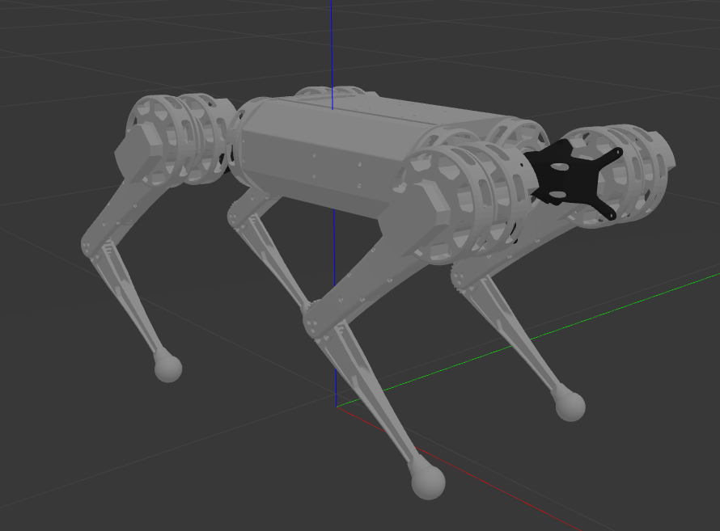

# Mini-Cheetah-ROS
* for urdf thx to [grassjelly and HitSZwang](https://github.com/HitSZwang/mini-cheetah-gazebo-urdf)



### In order to use this code, you shoud go through next steps:

```bash
cd catkin_ws/src
```

```bash
git clone https://github.com/Terminateit/Mini-Cheetah-ROS.git
```

```bash
cd ..
```

```bash
catkin_make
```

```bash
source devel/setup.bash
```

And here we are ready!


* If you want just to see the model:

```bash
roslaunch cheetah_show cheetah_gazebo.launch
```

* Position control:
```bash
roslaunch cheetah_control cheetah_control_position.launch
```

* Current control:
```bash
roslaunch cheetah_control cheetah_control_current.launch
```

* Velocity Control:
```bash
roslaunch cheetah_control cheetah_control_velocity.launch
```

